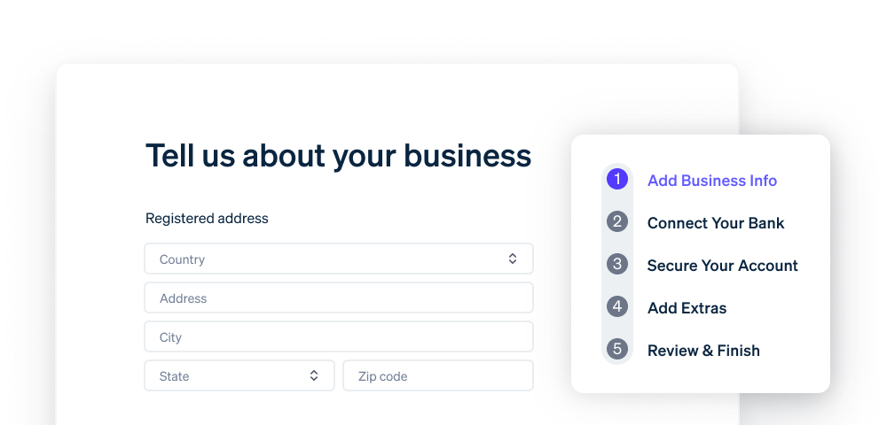

# Get started

Create an account and learn how to build on Stripe.


---
* ### Create an account
  - Set up a Stripe account and immediately start building your integration.
  - If you’re ready to start developing, see our [Checkout quickstart](tour.md)
  - [Create account ->](tour.md)
* 

***

### Common use cases


[Accept simple payments as a startup](tour.md)

Enable Stripe payments for your business without writing code.



[Sell subscriptions as a SaaS startup](tour.md)

Launch a pre-built subscriptions integration as a SaaS startup.



[Build a subscriptions solution for an AI startup with a usage-based pricing model](tour.md)

Create a customized payments integration to handle billing for usage-based pricing models.



[Accept in-person payments for a direct retail business](tour.md)

Accept card payments for your in-person business.



[Send invoices to collect payments for an online business](tour.md)

Send invoices to customers who want to pay through bank transfers.



[Migrate to PGX](tour.md)

Build a payments integration and migrate your customers to PGX.



### Start building


[Create a PGX account](tour.md)

Create and activate a PGX account.



[Set up your development environment](tour.md)

Get familiar with the Stripe CLI and our core SDKs.



[Build a subscriptions solution for an AI startup with a usage-based pricing model](tour.md)

Create a customized payments integration to handle billing for usage-based pricing models.



[Accept in-person payments for a direct retail business](tour.md)

Accept card payments for your in-person business.



[Send invoices to collect payments for an online business](tour.md)

Send invoices to customers who want to pay through bank transfers.



[Migrate to PGX](tour.md)

Build a payments integration and migrate your customers to PGX.



## more resources




#
#
#
### [Youtube resources](tour.md)

Watch tutorials, discover new features, and hear customer stories.






---
* 
* [Developer resources](tour.md)
  
  Sign up for the newsletter, follow Stripe on X, or chat with the community on the official Discord.
---
* 
* [Partner Directory](tour.md)
  
  Get expert help from certified service partners or use prebuilt integrations from technology partners.
---
* 
* [PGX Apps](tour.md)
  
  Connect your business tools, like customer management and accounting systems, to PGX.
---
* 
* [Support site](tour.md)
  
  CLearn the answers to common account questions and get troubleshooting tips and tricks.



